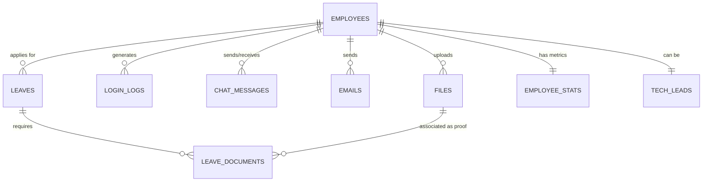

# 📊 AuraHR Enterprise Data Architecture Guide

This document provides a comprehensive technical overview of the AuraHR data storage system, its relational structure, and instructions for connecting and extending the system.

---

## 🏗️ 1. Relational Architecture (ER Diagram)

The system is built on a multi-schema PostgreSQL foundation. The following diagram illustrates how the core entities are interconnected.



---

## 🗃️ 2. Schema Breakdown

### 👤 Schema: `employee_data`
*   **`employees`**: The source of truth for user identity. Stores roles (`hr`, `manager`, `employee`, `tech_lead`) and leave balances.
*   **`leaves`**: Tracks every time-off request. Linked to `employees` via `employee_id`.
*   **`leave_documents`**: A junction table that links a `leave` request to a specific `file` proof.

### 🧠 Schema: `tech_leads_data`
*   **`tech_leads`**: Stores engineering-specific metadata. Linked to the `employees` table to inherit identity but maintains separate team associations.

### 🌐 Schema: `common_data`
*   **`files`**: The central registry for all binary data (Images, PDFs, Videos). It stores the **Physical Path** instead of the actual binary to ensure DB performance.
*   **`employee_stats`**: A high-performance table designed for the Dashboard. It is updated automatically via triggers.
*   **`chat_messages` & `emails`**: Store internal communications with foreign key constraints to ensure messages cannot exist without valid senders.

---

## 🤖 3. How the Automation Works (Triggers)

The system is "self-healing" and automatically updates state based on events:

1.  **Leave Approval Flow**:
    *   **Action**: HR updates `leaves.status` to `'approved'`.
    *   **Automation**: A trigger calculates the days between `from_date` and `to_date`, then automatically updates `employees.leaves_taken` and `employee_stats.total_leaves_taken`.
    
2.  **Login Intelligence**:
    *   **Action**: A new row is inserted into `login_logs`.
    *   **Automation**: The `employee_stats` table is instantly updated with the new `last_login` time and the `total_logins` counter is incremented.

---

## 📁 4. File Storage Connection

The system uses a **Hybrid Storage Model**:
*   **Physical Files**: Saved in `Hr/backend/storage/`.
*   **Database Reference**: The `common_data.files` table stores the `file_path`.

**To connect a UI element to a file:**
1.  Fetch the `file_path` from the `files` table.
2.  The backend serves this path via a static route (e.g., `/api/files/:id`).

---

## 🔌 5. How to Connect (Developer Setup)

### Environment Variables
Create a `.env` file in `Hr/backend/` with the following parameters:

```env
DB_HOST=localhost
DB_PORT=5432
DB_USER=postgres
DB_PASSWORD=your_secure_password
DB_NAME=aurahr
```

### Connection via Node.js
We use a **Connection Pool** (`pg.Pool`) to handle multiple concurrent requests efficiently.

```typescript
// Located in src/db_config.ts
import { Pool } from 'pg';
const pool = new Pool({ ... });
export const query = (text: string, params?: any[]) => pool.query(text, params);
```

### REST API Integration
To interact with the data from the frontend, use the following base routes:
*   **CRUD**: `/api/pg/employees`
*   **Workflow**: `/api/pg/leaves/apply`
*   **Media**: `/api/pg/upload` (Requires `multipart/form-data`)

---

## 🔐 6. Security Protocols
*   **Password Storage**: Never stored in plain text. Always use `bcrypt` with a minimum of 10 salt rounds.
*   **Schema Isolation**: Cross-schema queries are allowed but restricted by role-based database users in production.
*   **Validation**: All incoming data must pass the `postgres.routes.ts` Zod validation layer before touching the database.
